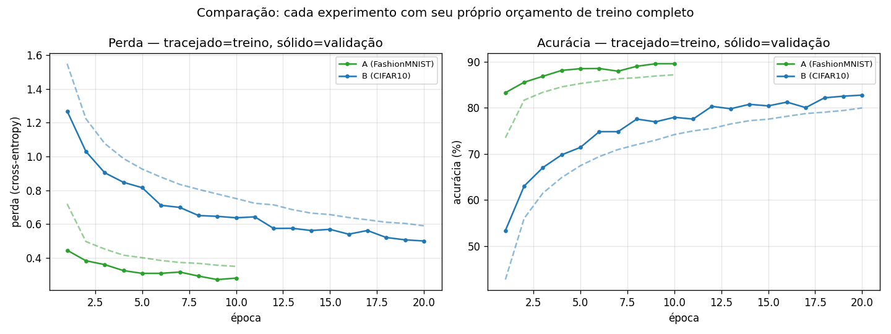
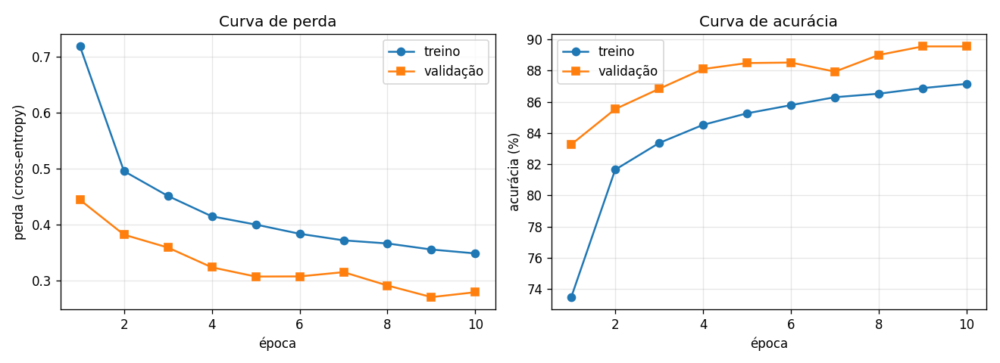
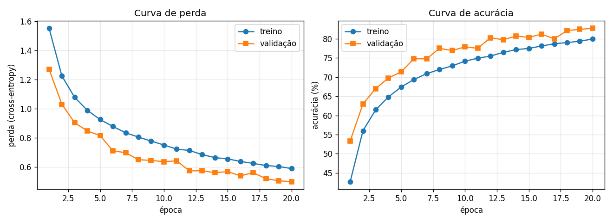
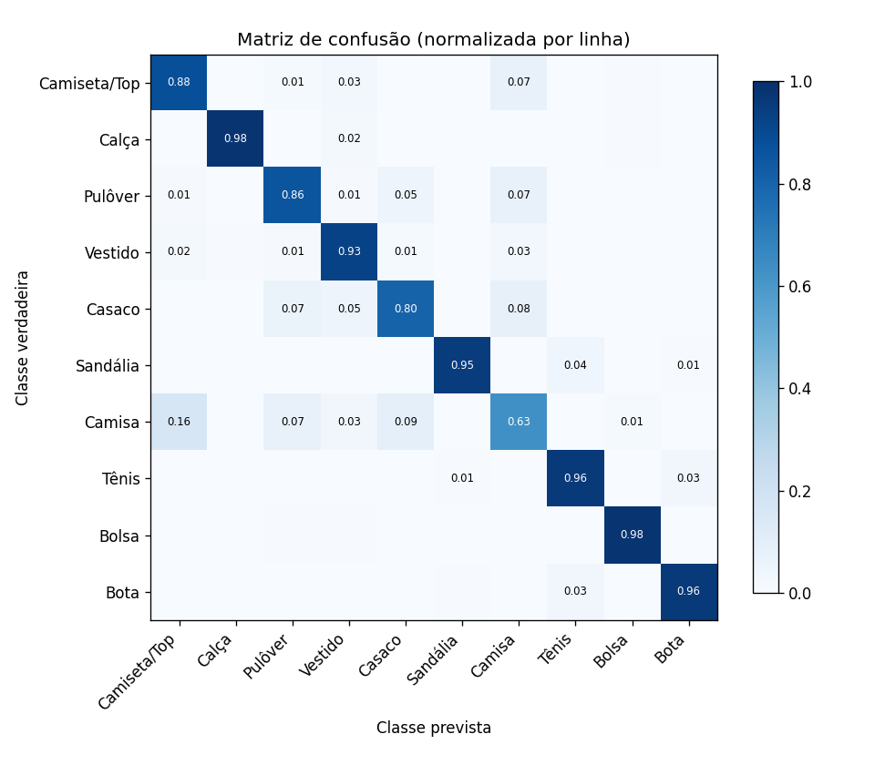
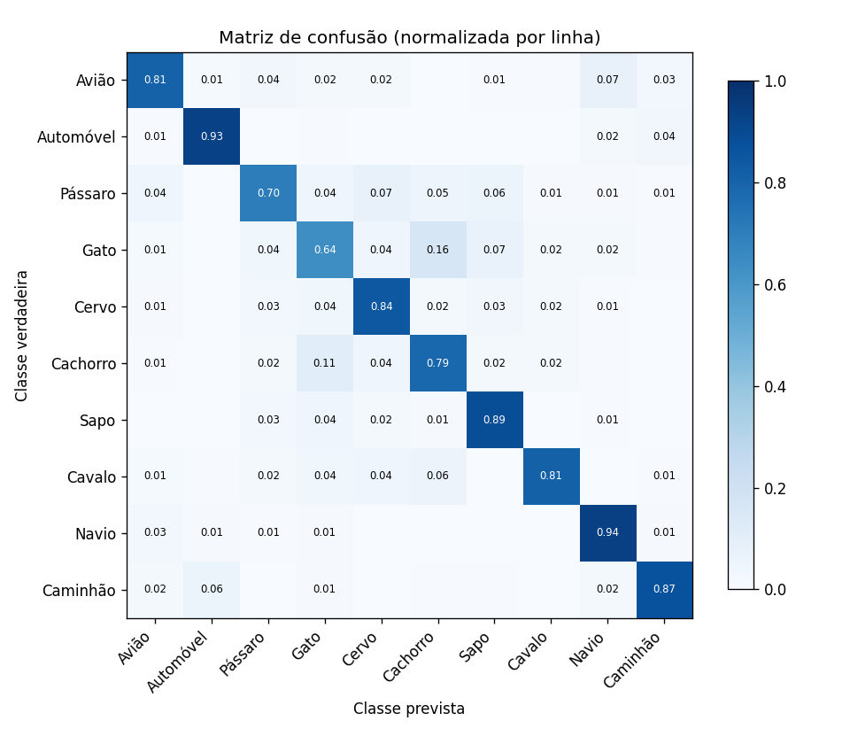
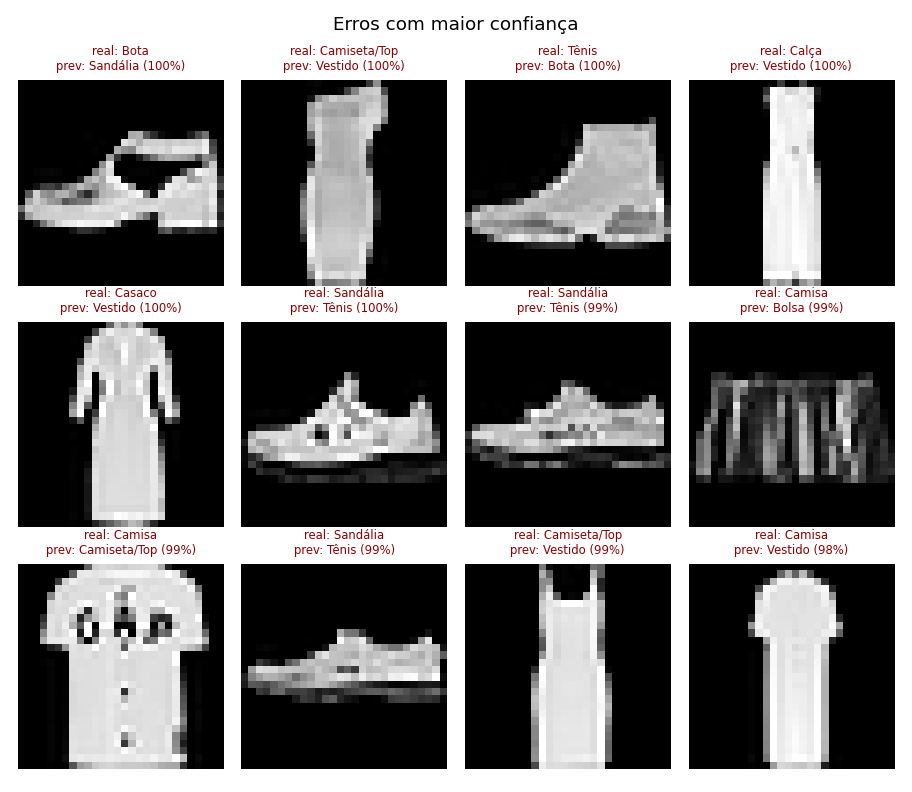
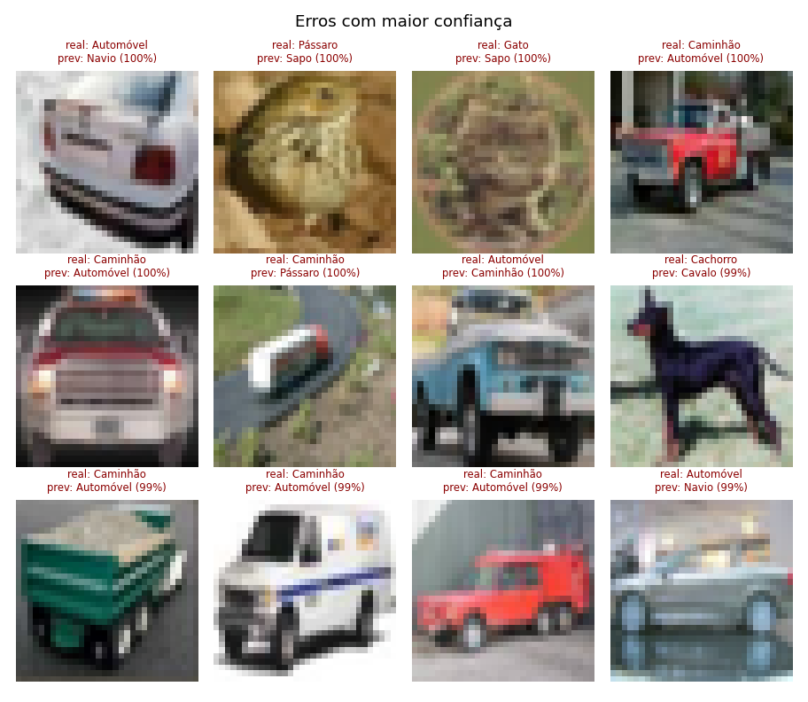

# CP5 - CNN — Comparação de esforço no treino dos datasets Fashion-MNIST × CIFAR-10

## 1. Relatório

**Projeto:** CP5 — Classificação de imagens com CNN
**Arquivo gerado ao executar:** `src/gerar_relatorio.py` a partir dos outputs reais de:
- Experimento A (FashionMNIST)
- Experimento B (CIFAR10): 

Nenhum número abaixo foi digitado à mão — todos vêm de `historico.json` e
`metricas_teste.json` gerados por `train.py`/`evaluate.py` em cada projeto.

---

## 2. Problema

O projeto inicial (`cnn_fashion`) treina uma CNN para classificar o
**FashionMNIST**: imagens em escala de cinza, 28×28
pixels, de 10 categorias de peças de roupa, fotografadas em estúdio,
centralizadas e sobre fundo preto uniforme.

Este projeto (`cnn_cifar10`) troca o dataset pelo **CIFAR10**:
imagens **coloridas** (RGB), 32×32 pixels, de 10 classes
de objetos e animais do mundo real, fotografados em cenas naturais, com
fundo, iluminação e enquadramento não controlados.

O problema dos 2 experimentos é classificação multiclasse
supervisionada. O que muda é a dimensão de entrada e, principalmente, a complexidade visual da distribuição dos dados — o objeto deste relatório é medir e explicar o quanto isso importa na prática, comparando os dois pipelines completos.

---

## 3. Pipeline

Os dois projetos seguem a mesma estrutura de 7 etapas:
- (1) aquisição do dataset via `torchvision.datasets`,
- (2) particionamento treino/validação/teste sem vazamento
- (3) transformações e augmentation (só no treino),
- (4) DataLoaders em lotes, (5) arquitetura CNN,
- (6) treino/validação com checkpoint do melhor modelo e early stopping, e
- (7) avaliação no teste + exportação para TorchScript.

### 3.1 Configuração de cada experimento (lido o arquivo `historico.json`)

| Parâmetro | Experimento A — FashionMNIST | Experimento B — CIFAR10 |
|---|---|---|
| Canais de entrada | 1 | 3 |
| Tamanho da imagem | 28×28 | 32×32 |
| Normalização (média) | [0.286] | [0.4914, 0.4822, 0.4465] |
| Normalização (desvio) | [0.353] | [0.247, 0.2435, 0.2616] |
| Blocos convolucionais | (16, 32, 64) | (32, 64, 128, 256) |
| Neurônios na FC | 128 | 256 |
| Dropout | 0.3 | 0.4 |
| Parâmetros treináveis | 98,554 | 653,866 |
| Épocas configuradas / paciência | 10 / 3 | 20 / 5 |
| Batch size / lr | 128 / 0.001 | 128 / 0.001 |
| Semente | 42 | 42 |

A rede do Experimento B é mais profunda (4 blocos
contra 3) e tem 6.6×
mais parâmetros — decisão tomada porque fotos coloridas de cenas reais têm
muito mais variação visual (fundo, iluminação, pose, oclusão) do que roupas
centralizadas em fundo uniforme.

---

## 4. Tabela de experimentos

| | Experimento A (FashionMNIST) | Experimento B (CIFAR10) |
|---|---|---|
| Imagens de treino / validação / teste | 54,000 / 6,000 / 10,000 | 45,000 / 5,000 / 10,000 |
| Épocas até o melhor modelo | 9 de 10 | 20 de 20 |
| Melhor acurácia de validação | 89.55% | 82.74% |
| **Acurácia de teste** | **89.33%** | **82.19%** |
| Perda de teste | 0.2832 | 0.5162 |

**Diferença de acurácia de teste: 7.14 pontos percentuais**
a favor do Fashion-MNIST (89.33% → 82.19%).

Note que essa diferença já é medida com os dois pipelines em condição
"justa" de treino completo — nenhum dos dois parou cedo por falta de dados
ou de épocas (Experimento A convergiu na época 9 de
10; Experimento B usou uma rede
6.6× maior e ainda assim ficou
7.1 pontos abaixo). Isso é evidência de que a queda de
acurácia não é falta de capacidade do modelo — é a dificuldade específica de cada experimento.

---

## 5. Curvas de treinamento

*(Tracejado = treino, sólido/marcadores = validação. Gerado a partir dos
`historico.json` reais de cada projeto — 10
épocas no Experimento A, 20 no Experimento B.)*

### Curva individual de cada experimento:

| Experimento A — FashionMNIST | Experimento B — CIFAR10 |
|---|---|
|  |  |

**Comparativo**: o Experimento A converge de forma mais suave e a validação fica consistentemente próxima ou acima do treino — sinal de que a tarefa é fácil o bastante para o modelo aprender bem com poucas épocas. O Experimento B parte de perdas mais altas e a curva de validação é mais ruidosa — sinal de fronteiras de decisão mais difíceis de aprender, mesmo com uma rede maior e mais épocas disponíveis.

---

## 6. Matriz de confusão

| Experimento A — FashionMNIST | Experimento B — CIFAR10 |
|---|---|
|  |  |

**Confusões mais fáceis e difíceis (Experimento A, FashionMNIST):**
- **Classes mais fáceis (Experimento A):** Calça (F1=0.99), Bolsa (F1=0.98), Sandália (F1=0.97)
- **Classes mais difíceis (Experimento A):** Camisa (F1=0.67), Casaco (F1=0.82), Pulôver (F1=0.85)

**Confusões mais fáceis e difíceis (Experimento B, CIFAR10):**
- **Classes mais fáceis (Experimento B):** Automóvel (F1=0.92), Navio (F1=0.89), Caminhão (F1=0.89)
- **Classes mais difíceis (Experimento B):** Gato (F1=0.66), Pássaro (F1=0.75), Cachorro (F1=0.75)

**Confusões mais frequentes (Experimento A, FashionMNIST):**
- **Camisa → Camiseta/Top**: 16% das imagens de Camisa foram previstas como Camiseta/Top (162 casos)
- **Camisa → Casaco**: 9% das imagens de Camisa foram previstas como Casaco (87 casos)
- **Casaco → Camisa**: 8% das imagens de Casaco foram previstas como Camisa (79 casos)
- **Camisa → Pulôver**: 7% das imagens de Camisa foram previstas como Pulôver (74 casos)
- **Pulôver → Camisa**: 7% das imagens de Pulôver foram previstas como Camisa (73 casos)

**Confusões mais frequentes (Experimento B, CIFAR10):**
- **Gato → Cachorro**: 16% das imagens de Gato foram previstas como Cachorro (160 casos)
- **Cachorro → Gato**: 11% das imagens de Cachorro foram previstas como Gato (107 casos)
- **Pássaro → Cervo**: 8% das imagens de Pássaro foram previstas como Cervo (75 casos)
- **Avião → Navio**: 7% das imagens de Avião foram previstas como Navio (74 casos)
- **Gato → Sapo**: 7% das imagens de Gato foram previstas como Sapo (67 casos)

A natureza das confusões é qualitativamente diferente: no
FashionMNIST, os erros ficam concentrados em subcategorias muito
próximas de um mesmo tipo de peça, porque o fundo é sempre preto e a pose é
sempre a mesma. No CIFAR10, a confusão aparece entre classes que compartilham pistas visuais de baixo nível (cor, textura, fundo da cena).

---

## 7. Análise de erros

| Experimento A — FashionMNIST | Experimento B — CIFAR10 |
|---|---|
|  |  |

Esses mosaicos mostram os erros em que o modelo estava mais confiante — ou
seja, os casos mais "enganosos" de cada dataset. No Experimento B, boa parte
desses erros de alta confiança tende a envolver classes que compartilham
fundo de cena (céu, água, vegetação) ou silhueta (veículos de carroceria
fechada) — um tipo de erro que não existe no Experimento A, onde não há
fundo variável e a única fonte de confusão é a forma da peça de roupa.

---

## 8. Conclusão

Comparando os dois pipelines **completos**:

- **Acurácia de teste:** 89.33% (FashionMNIST) vs.
  82.19% (CIFAR10) — uma diferença de
  **7.14 pontos percentuais**.
- **Acurácia de validação (melhor época):** 89.55%
  vs. 82.74% — diferença de 6.81 pontos.
- O Experimento B usa uma rede **6.6×
  maior** (653,866 vs. 98,554 parâmetros)
  e mesmo assim não alcança a acurácia do Experimento A — reforçando que o
  gargalo é a dificuldade dos dados, não a capacidade do modelo.

Analisando a matriz de confusão e os erros entendemos que:

1. **Fundo não controlado** — o FashionMNIST tem fundo preto uniforme;
   o CIFAR10 tem cenas reais, o que introduz um problema
   de separar objeto de contexto.
2. **Maior variação entre as imagens da própria classe** — cada classe do CIFAR10 cobre
   dezenas de poses, ângulos e enquadramentos, contra uma pose/enquadramento
   padronizado por peça no FashionMNIST.
3. **Maior similaridade entre classes diferentes** — pares de classes
   compartilham silhueta e textura a ponto de a confusão superar o acerto
   em alguns casos.
4. **Resolução baixa para cenas complexas** — 32×32
   pixels é pouco para diferenciar detalhes finos que resolveriam boa parte
   dessas confusões.

**Reprodutibilidade:** todos os números deste relatório são recalculados
automaticamente por `python src/gerar_relatorio.py` a partir dos outputs
reais de `train.py`/`evaluate.py` dos dois projetos — nenhum valor é
hardcoded no relatório. Se qualquer um dos dois pipelines for retreinado, os
números aqui mudam junto na próxima vez que este script rodar.
