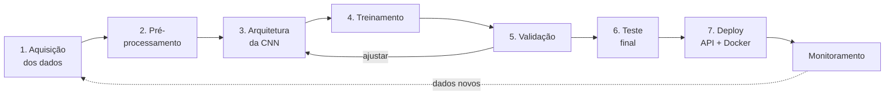
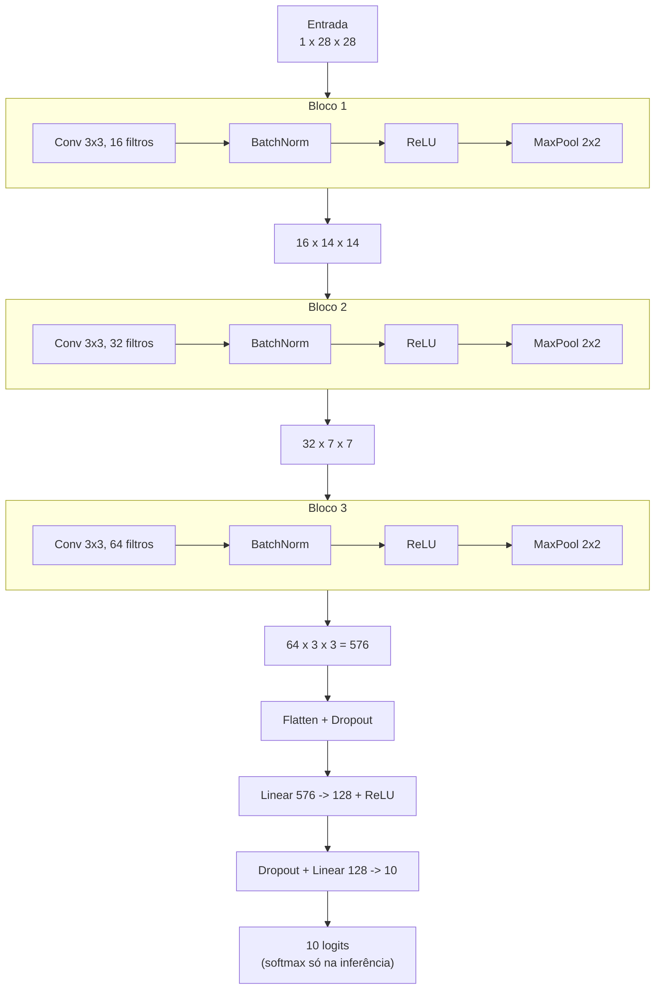

# Aula — Redes Neurais Convolucionais na prática: do dado ao deploy

**Disciplina:** ARTIFICIAL INTELLIGENCE e DEEP LEARNING APPLICADA
**Professor:** Dr. Alexandre Miguel de Carvalho
**Ferramentas:** Python 3.12 · PyTorch 2.5 (CPU) · torchvision · FastAPI

---

## 1. Por que esta aula existe

A maioria dos tutoriais de CNN termina quando a acurácia aparece na tela. Só que um modelo que existe apenas dentro de um notebook não resolve problema nenhum.
O que separa um exercício de um sistema é o **pipeline completo**:



Nesta aula você percorre as **sete etapas** com um problema pequeno o bastante
para rodar em CPU em poucos minutos, mas completo o bastante para ser honesto:
separação correta de dados, checkpoint do melhor modelo, early stopping, métricas
por classe, exportação para produção e um serviço HTTP funcionando.

### Aplicação escolhida

**Classificar fotos de peças de roupa em 10 categorias** (camiseta, calça,
pulôver, vestido, casaco, sandália, camisa, tênis, bolsa, bota) usando o dataset
**Fashion-MNIST** — 70.000 imagens em escala de cinza, 28×28 pixels.

Por que esse dataset numa primeira aula:

| Critério | Justificativa |
|---|---|
| Tamanho | 70k imagens, ~30 MB — baixa em segundos |
| Custo | Treina em **~30 s por época na CPU**, sem GPU |
| Dificuldade | Difícil o bastante para uma CNN vencer um MLP com folga |
| Realismo | Tem classes genuinamente confundíveis (camisa × pulôver × casaco), o que força a discussão de matriz de confusão — coisa que o MNIST de dígitos não oferece |

---

## 2. Objetivos de aprendizagem

Ao final da aula, o estudante deve ser capaz de:

1. **Explicar** por que convolução é mais adequada que camadas densas para imagens, usando os conceitos de conectividade local, compartilhamento de pesos e invariância a translação.
2. **Calcular** o formato do tensor em cada camada da rede a partir da fórmula de saída da convolução.
3. **Construir** um pipeline de dados no PyTorch com `Dataset`, `transforms` e `DataLoader`, separando treino, validação e teste sem vazamento.
4. **Implementar** o laço de treinamento (forward → perda → `zero_grad` → `backward` → `step`) e explicar o papel de cada passo.
5. **Diagnosticar** underfitting e overfitting a partir das curvas de perda e acurácia.
6. **Avaliar** o modelo além da acurácia: matriz de confusão, precisão, revocação e F1 por classe.
7. **Publicar** o modelo como serviço: exportação em TorchScript, API REST e contêiner Docker.

---

## 3. Preparação do ambiente

```bash
conda activate p_312          # ambiente já existente nesta máquina
cd caminho/para/cnn
pip install -r requirements.txt
```

Verificação rápida:

```bash
python -c "import torch, torchvision; print(torch.__version__, torchvision.__version__)"
# 2.5.1+cpu 0.20.1+cpu
```

> **Windows:** se os acentos aparecerem quebrados no terminal, rode `chcp 65001`
> ou defina `set PYTHONIOENCODING=utf-8` antes dos scripts.

### Estrutura do projeto

```
cnn/
├── README.md              <- esta aula
├── exercicios.md          <- atividades e rubrica de avaliação
├── requirements.txt
├── src/
│   ├── config.py          <- ETAPA 0: hiperparâmetros e caminhos, em um lugar só
│   ├── utils.py           <- semente, dispositivo, gráficos
│   ├── data.py            <- ETAPAS 1 e 2: aquisição + pré-processamento
│   ├── model.py           <- ETAPA 3: arquitetura da CNN
│   ├── train.py           <- ETAPAS 4 e 5: treinamento + validação
│   ├── evaluate.py        <- ETAPA 6: teste, matriz de confusão, métricas
│   ├── predict.py         <- inferência em imagens novas
│   └── export_model.py    <- ETAPA 7-A: TorchScript / ONNX
├── deploy/
│   ├── api.py             <- ETAPA 7-B: serviço FastAPI
│   ├── testar_api.py      <- teste de integração do serviço
│   └── Dockerfile         <- ETAPA 7-C: contêiner
├── data/                  <- dataset (baixado automaticamente)
└── outputs/               <- pesos, gráficos e métricas gerados
```

---

## 4. Fundamentos: o mínimo de teoria necessário

### 4.1 Por que não usar uma rede densa comum?

Uma imagem 28×28 achatada vira um vetor de 784 números. Ligando isso a uma
camada densa de 128 neurônios: **100.352 pesos só na primeira camada**. Para uma
foto de celular de 1024×1024 em RGB, seriam mais de **400 milhões**. Pior: ao
achatar, você joga fora a informação de que dois pixels vizinhos têm relação — e
um gato deslocado 3 pixels para a direita vira, para a rede, uma entrada
completamente diferente.

### 4.2 A operação de convolução

Um **filtro** (ou *kernel*) é uma matriz pequena — tipicamente 3×3 — que desliza
sobre a imagem. Em cada posição calcula-se a soma dos produtos entre o filtro e a
região coberta:

```
   imagem (região 3x3)        filtro 3x3            saída
   ┌───┬───┬───┐          ┌────┬────┬────┐
   │ 10│ 10│ 10│          │ +1 │  0 │ -1 │
   ├───┼───┼───┤          ├────┼────┼────┤      10*1 + 10*0 + 10*(-1) +
   │ 10│ 10│ 10│    ⊛     │ +1 │  0 │ -1 │  =   ...  =  30
   ├───┼───┼───┤          ├────┼────┼────┤
   │  0│  0│  0│          │ +1 │  0 │ -1 │
   └───┴───┴───┘          └────┴────┴────┘
```

O filtro acima responde forte em **bordas verticais**. A diferença fundamental
para o processamento de imagens clássico: **você não projeta o filtro** — os
nove valores são pesos aprendidos por retropropagação. A rede descobre sozinha
quais detectores são úteis para a tarefa.

Três propriedades decorrem disso:

- **Conectividade local** — cada neurônio olha uma vizinhança, não a imagem toda.
- **Compartilhamento de pesos** — o mesmo filtro percorre toda a imagem; são 9 pesos, não 9 por posição. Daí a economia brutal de parâmetros.
- **Invariância a translação** — combinada ao *pooling*, faz com que o objeto seja reconhecido em qualquer posição.

### 4.3 Hiperparâmetros da convolução e a fórmula do tamanho

| Parâmetro | O que faz |
|---|---|
| `kernel_size` | Tamanho da janela (3 é o padrão moderno) |
| `stride` | Passo do deslizamento (2 reduz a resolução pela metade) |
| `padding` | Zeros nas bordas; com `padding=1` e `kernel=3` a resolução se mantém |
| `out_channels` | Quantos filtros diferentes serão aprendidos |

$$\text{saída} = \left\lfloor \frac{\text{entrada} + 2 \cdot \text{padding} - \text{kernel}}{\text{stride}} \right\rfloor + 1$$

Confira: entrada 28, padding 1, kernel 3, stride 1 → (28 + 2 − 3)/1 + 1 = **28**.
Resolução preservada. Depois um `MaxPool2d(2,2)` → **14**.

### 4.4 As outras peças do bloco

- **ReLU** — `f(x) = max(0, x)`. Sem uma não-linearidade entre as camadas, empilhar convoluções seria matematicamente equivalente a uma única convolução.
- **MaxPooling 2×2** — mantém o maior valor de cada janela. Reduz o custo pela metade em cada dimensão e dá tolerância a pequenos deslocamentos.
- **BatchNormalization** — normaliza as ativações dentro do lote. Estabiliza o treino, permite taxas de aprendizado maiores e funciona como leve regularizador.
- **Dropout** — durante o treino, desliga aleatoriamente uma fração dos neurônios. Impede que a rede dependa de um caminho único e reduz o overfitting. **Só age em modo treino** — por isso `modelo.eval()` é obrigatório na inferência.

### 4.5 A arquitetura desta aula



Repare no padrão clássico: a **resolução espacial cai** (28 → 14 → 7 → 3)
enquanto a **profundidade de canais sobe** (1 → 16 → 32 → 64). A rede troca
"onde está" por "o que é". No fim, **98.554 parâmetros** — cerca de 1/4 do que
uma rede densa equivalente gastaria só na primeira camada, com desempenho muito
superior.

### 4.6 Como a rede aprende

1. **Perda** — `CrossEntropyLoss` mede a distância entre a distribuição prevista e o rótulo correto. Se a rede dá 90 % de probabilidade à classe certa, a perda é baixa; se dá 5 %, é alta.
2. **Retropropagação** — `loss.backward()` aplica a regra da cadeia e calcula, para cada peso, quanto ele contribuiu para o erro.
3. **Otimizador** — `optimizer.step()` move cada peso na direção contrária ao seu gradiente, com passo proporcional à taxa de aprendizado.

Repetir isso por milhares de lotes é, literalmente, todo o "aprendizado".

---

## 5. O pipeline, etapa por etapa

### ETAPA 1 — Aquisição dos dados

**Arquivo:** [src/data.py](src/data.py) · **Comando:** `python src/data.py`

O torchvision baixa o Fashion-MNIST automaticamente para `data/`. Em projetos
reais essa etapa envolveria coletar imagens, rotular e versionar — e é aqui que
a maior parte do esforço de um projeto de visão computacional realmente vai.

O ponto pedagógico é o **particionamento**:

| Conjunto | Tamanho | Para que serve | Quem pode "ver" |
|---|---|---|---|
| Treino | 54.000 | Ajustar os pesos | O otimizador |
| Validação | 6.000 | Escolher hiperparâmetros, decidir quando parar | Você, muitas vezes |
| Teste | 10.000 | Estimar o desempenho real | Ninguém, até o fim |

O torchvision entrega só treino e teste; a validação é retirada de dentro do
treino. **O conjunto de teste é usado uma única vez, no final.** Se você ajustar
qualquer coisa olhando o teste, ele deixou de ser teste e virou validação — e
seu número final passa a ser otimista, isto é, mentiroso.

> **Erro clássico que o código evita:** usar `random_split` direto faz treino e
> validação compartilharem o mesmo objeto `Dataset` e, portanto, a mesma
> transformação — sua validação ganharia *data augmentation* aleatório e a
> métrica oscilaria sem sentido. A solução usada aqui é carregar o dataset duas
> vezes, cada uma com sua transformação, e aplicar os mesmos índices via
> `Subset`. Veja o comentário em [src/data.py](src/data.py).

### ETAPA 2 — Pré-processamento

**Arquivo:** [src/data.py](src/data.py) → `construir_transformacoes()`

```python
transform_treino = transforms.Compose([
    transforms.RandomHorizontalFlip(p=0.5),
    transforms.RandomCrop(28, padding=2),
    transforms.RandomRotation(degrees=8),
    transforms.ToTensor(),                       # PIL [0,255] -> tensor [0,1], (C,H,W)
    transforms.Normalize((0.2860,), (0.3530,)),  # (x - média) / desvio
])
```

Três decisões para discutir em sala:

1. **`ToTensor` antes de `Normalize`** — a ordem importa. E note que PyTorch usa
   canal-primeiro `(C, H, W)`, ao contrário de OpenCV e Matplotlib.
2. **Normalização** — centralizar em média ~0 e desvio ~1 acelera muito a
   convergência. Os valores 0,2860 e 0,3530 são as estatísticas do **conjunto de
   treino** do Fashion-MNIST (calculá-las usando o teste seria vazamento).
3. **Aumento de dados só no treino** — espelhar uma camiseta continua sendo uma
   camiseta, então o *flip* horizontal gera exemplos válidos de graça. Mas
   validação e teste têm de ser determinísticos, senão a métrica vira ruído.
   Repare que `RandomVerticalFlip` seria um erro aqui: sandália de cabeça para
   baixo não aparece no mundo real e ensinaria a rede a algo inútil.

**Execute e olhe o mosaico** gerado em `outputs/amostra_treino.png`. Sempre
inspecione visualmente os dados antes de treinar: um modelo alimentado com dados
errados não reclama, ele apenas aprende a coisa errada com 99 % de confiança.

### ETAPA 3 — Arquitetura

**Arquivo:** [src/model.py](src/model.py) · **Comando:** `python src/model.py`

O script imprime a rede, conta os parâmetros e mostra o formato do tensor após
cada bloco:

```
Parâmetros treináveis: 98,554
Entrada (4, 1, 28, 28) -> saída (4, 10)
  bloco 1: (4, 16, 14, 14)
  bloco 2: (4, 32, 7, 7)
  bloco 3: (4, 64, 3, 3)
```

Dois detalhes de implementação que valem a discussão:

- **O tamanho do *flatten* é descoberto empiricamente**, passando um tensor de
  zeros pelo extrator. Calcular 576 "na mão" funciona até você mudar o número de
  blocos e passar meia hora atrás de um `shape mismatch`.
- **O `forward` devolve *logits*, sem softmax.** `nn.CrossEntropyLoss` já aplica
  `log_softmax` internamente; colocar um softmax no modelo significa aplicá-lo
  duas vezes, o que deixa o treino lento e instável. O softmax entra apenas na
  hora de interpretar a saída como probabilidade ([src/predict.py](src/predict.py)).

### ETAPA 4 — Treinamento

**Arquivo:** [src/train.py](src/train.py)

```bash
python src/train.py --rapido        # ~15 s, para demonstrar em sala
python src/train.py --epocas 12     # treino completo, ~25 s/época = ~5 min em CPU
```

O núcleo, que se repete em todo projeto PyTorch:

```python
logits = modelo(x)                       # 1. forward
perda  = criterio(logits, y)             # 2. perda
otimizador.zero_grad(set_to_none=True)   # 3. zerar gradientes anteriores
perda.backward()                         # 4. retropropagação
otimizador.step()                        # 5. atualizar pesos
```

> **Esquecer o `zero_grad()` é o bug nº 1 de quem começa.** O PyTorch *acumula*
> gradientes por padrão (recurso útil para simular lotes grandes). Sem zerar, o
> gradiente do lote 100 carrega a soma dos 99 anteriores e o treino diverge sem
> nenhuma mensagem de erro.

Recursos de treino sério já incluídos:

- **Checkpoint do melhor modelo** — salva quando a acurácia de *validação* melhora, não na última época. A última quase nunca é a melhor.
- **Early stopping** (`paciencia=3`) — interrompe quando a validação para de melhorar. Economiza tempo e evita continuar decorando o treino.
- **`ReduceLROnPlateau`** — reduz a taxa de aprendizado pela metade quando a validação estaciona: passos grandes para explorar, passos pequenos para refinar.
- **Semente fixa** — sem `definir_semente()`, dois treinos idênticos dão números diferentes e a comparação entre experimentos perde o sentido.

### ETAPA 5 — Validação (o diagnóstico)

Ao final, abra `outputs/curvas_treino.png`. É o gráfico mais importante da
disciplina:

| O que você vê | Diagnóstico | O que fazer |
|---|---|---|
| Ambas as perdas altas e paradas | **Underfitting** — modelo fraco demais | Mais filtros/blocos, treinar mais, aumentar o *lr* |
| Perda de treino cai, a de validação **sobe** | **Overfitting** — está decorando | Mais aumento de dados, mais dropout, *weight decay*, early stopping |
| Perda oscilando muito | Taxa de aprendizado alta demais | Reduzir o *lr*, aumentar o *batch* |
| As duas caem juntas e estabilizam | Saudável | Pode tentar aumentar a capacidade do modelo |

O que caracteriza validação (e não treino) no código: `modelo.eval()` para
desligar dropout e congelar as estatísticas do BatchNorm, `torch.no_grad()` para
não construir o grafo de derivadas, e ausência de `backward()`/`step()`.

### ETAPA 6 — Teste final

**Arquivo:** [src/evaluate.py](src/evaluate.py) · **Comando:** `python src/evaluate.py`

Saída real desta implementação (12 épocas, CPU, semente 42):

```
TESTE — 10000 imagens
Acurácia global: 89.57%   |   Perda: 0.2772
classe            precisão   revocação      F1      n
Camiseta/Top         0.793       0.894   0.841   1000
Calça                0.997       0.977   0.987   1000
Pulôver              0.841       0.873   0.857   1000
Vestido              0.862       0.940   0.900   1000
Casaco               0.844       0.841   0.843   1000
Sandália             0.981       0.946   0.963   1000
Camisa               0.766       0.585   0.663   1000
Tênis                0.909       0.980   0.943   1000
Bolsa                0.980       0.975   0.977   1000
Bota                 0.977       0.946   0.961   1000

Classes mais difíceis: Camisa (F1=0.66), Camiseta/Top (F1=0.84), Casaco (F1=0.84)
```

Note a assimetria da classe **Camisa**: precisão 0,77 mas revocação **0,59** — o
modelo encontra pouco mais da metade das camisas, e as perdidas viram
"camiseta", "pulôver" ou "casaco". Uma acurácia global de 89,6 % esconde
completamente esse buraco. É exatamente esse tipo de leitura que a etapa de
teste precisa produzir.

Além da acurácia, o script gera:

- **`outputs/matriz_confusao.png`** — o mapa de quem é confundido com quem. Você vai ver um bloco denso entre **camisa, camiseta, pulôver e casaco**: são peças de tronco, em 28×28 e escala de cinza, genuinamente parecidas. Já calça e bolsa quase nunca erram. Essa leitura é o objetivo pedagógico da etapa: acurácia global esconde a estrutura do erro.
- **`outputs/erros_teste.png`** — os erros em que o modelo estava **mais confiante**. Alguns são difíceis mesmo para humanos; outros revelam ruído de rotulagem do dataset. Analisar erro é mais informativo que comemorar acerto.

**Referências para comparar seu resultado:**

| Abordagem | Acurácia no teste |
|---|---|
| Chute aleatório | 10 % |
| Regressão logística | ~84 % |
| MLP denso (2 camadas) | ~88 % |
| **Esta CNN (12 épocas, ~5 min de CPU)** | **~89–90 %** |
| Esta mesma CNN com 30–40 épocas | ~91–92 % |
| Estado da arte (redes grandes + augmentation pesado) | ~96 % |

> O treino aqui é curto de propósito, para caber em uma aula. Se quiser mostrar
> o ganho de treinar mais, rode `python src/train.py --epocas 40` antes da aula
> e compare as duas matrizes de confusão.

### ETAPA 7 — Deploy

#### 7-A. Exportar o modelo

```bash
python src/export_model.py          # gera outputs/modelo_scriptado.pt
python src/export_model.py --onnx   # opcional: formato aberto ONNX
```

Um checkpoint com `state_dict` é ótimo para pesquisa e ruim para produção: para
carregá-lo é preciso ter a classe `CNNSimples` disponível e idêntica à do dia do
treino. Se alguém renomear um atributo, o serviço quebra.

**TorchScript** serializa arquitetura e pesos juntos, num formato que roda sem o
código-fonte original — inclusive em C++. O script ainda faz a verificação
obrigatória: compara as saídas do modelo original e do exportado e exige
diferença menor que 1e-4. **Nunca confie em uma exportação sem comparar as
saídas.**

#### 7-B. Servir como API

```bash
pip install fastapi "uvicorn[standard]" python-multipart
python -m uvicorn deploy.api:app --reload --port 8000
```

- <http://127.0.0.1:8000> — formulário de teste
- <http://127.0.0.1:8000/docs> — documentação interativa (Swagger)
- `GET /saude` — *health check*
- `POST /prever` — recebe uma imagem, devolve as 3 classes mais prováveis

Teste de integração, em outro terminal:

```bash
python deploy/testar_api.py --n 20
```

```
saúde: {'status': 'ok', 'modelo_carregado': True, 'n_classes': 10}
[OK  ] amostra_002.png | previsto: Calça (99.9%) | verdadeiro: Calça | 0.9 ms
...
Acertos: 18/20 (90%)
Latência média: 3.2 ms por imagem
```

Três decisões de engenharia visíveis em [deploy/api.py](deploy/api.py):

1. **O serviço não importa nada de `src/`.** Depende apenas de dois artefatos: `modelo_scriptado.pt` e `classes.json`. É assim que se separa pesquisa de produção.
2. **O modelo é carregado uma vez**, no `lifespan` do servidor — nunca por requisição. Carregar por requisição é o erro de desempenho mais comum em deploy de ML.
3. **O pré-processamento é reimplementado no servidor** e precisa ser byte a byte equivalente ao do treino. É justamente isso que `testar_api.py` verifica: se a acurácia da API cair muito abaixo da do `evaluate.py`, o bug está no deploy, não no modelo. **Esse é o erro silencioso mais comum em produção de visão computacional.**

#### 7-C. Empacotar em contêiner

```bash
docker build -t cnn-roupas -f deploy/Dockerfile .
docker run -p 8000:8000 cnn-roupas
```

Repare no que entra na imagem: só o código do serviço e os artefatos. Dataset e
scripts de treino ficam de fora. A imagem usa `torch` versão CPU (~300 MB em vez
de ~2,5 GB) e declara um `HEALTHCHECK` — é ele que o orquestrador consulta para
decidir se a instância pode receber tráfego.

#### 7-D. E depois do deploy?

O ciclo não termina. Em produção você precisa de:

- **Monitoramento de *drift*** — a distribuição das imagens reais muda com o tempo (câmera nova, moda nova, iluminação diferente) e a acurácia cai silenciosamente.
- **Registro de predições de baixa confiança** — quando `confianca < 0,5`, provavelmente a imagem está fora do domínio de treino. Essas amostras são candidatas naturais a rotulagem manual e retreino.
- **Versionamento de modelo** — todo artefato deve carregar a versão dos dados e do código que o geraram.

---

## 6. Roteiro de execução completo

```bash
conda activate p_312
cd cnn
pip install -r requirements.txt

python src/data.py                 # 1-2. inspecionar dados (gera amostra_treino.png)
python src/model.py                # 3.   conferir arquitetura e formatos
python src/train.py --rapido       #      ensaio rápido (~15 s)
python src/train.py --epocas 12    # 4-5. treino completo (~5 min em CPU)
python src/evaluate.py             # 6.   teste + matriz de confusão
python src/export_model.py         # 7A.  TorchScript
python -m uvicorn deploy.api:app --port 8000     # 7B. servidor
python deploy/testar_api.py --n 20               #     (em outro terminal)
```

### Sugestão de cronograma (4 h)

| Tempo | Conteúdo |
|---|---|
| 0:00–0:30 | Motivação, o problema, por que CNN e não MLP (§4.1–4.2) |
| 0:30–1:00 | Convolução, pooling, fórmula do tamanho — no quadro, com exercício de cálculo |
| 1:00–1:30 | Etapas 1 e 2 ao vivo: `data.py`, inspeção do mosaico, discussão de vazamento e augmentation |
| 1:30–2:00 | Etapa 3: `model.py`, contagem de parâmetros, rastreio dos formatos |
| 2:00–2:20 | *Intervalo* — deixe `train.py --epocas 12` rodando |
| 2:20–3:00 | Etapas 4 e 5: laço de treino no quadro, leitura das curvas, diagnóstico |
| 3:00–3:30 | Etapa 6: matriz de confusão, análise dos erros, métricas por classe |
| 3:30–4:00 | Etapa 7: exportação, API no navegador, discussão de produção |

---

## 7. Erros comuns (guia de sobrevivência)

| Sintoma | Causa provável | Correção |
|---|---|---|
| A perda não desce | `zero_grad()` faltando, ou *lr* absurdo | Verifique os 5 passos do laço; teste `lr=1e-3` |
| Acurácia ótima no treino, péssima no teste | Overfitting, ou vazamento entre conjuntos | Mais augmentation/dropout; confira o particionamento |
| Acurácia da API muito menor que a do `evaluate.py` | Pré-processamento diferente no servidor | Compare tamanho, escala de cinza, normalização |
| `RuntimeError: shape mismatch` na primeira camada densa | Tamanho do flatten calculado errado | Use a descoberta empírica de `model.py` |
| Resultado muda a cada execução | Semente não fixada | `definir_semente(42)` |
| Predições estranhas mas sem erro | `modelo.eval()` esquecido — dropout ativo | Sempre `eval()` antes de inferir |
| Foto real classificada errado | Fundo claro (o dataset tem fundo escuro) | `python src/predict.py foto.jpg --inverter` |
| `RuntimeError` de DataLoader no Windows | `num_workers > 0` sem `if __name__ == "__main__"` | Mantenha `num_workers=0` (padrão do `config.py`) |

---

## 8. Atividades

As atividades práticas, o desafio final e a rubrica de avaliação estão em
**[exercicios.md](exercicios.md)**.

---

## 9. Glossário

| Termo | Significado |
|---|---|
| **Época** | Uma passada completa por todo o conjunto de treino |
| **Lote (*batch*)** | Grupo de amostras processadas juntas antes de atualizar os pesos |
| **Logit** | Saída bruta da rede, antes do softmax; pode ser negativa |
| **Mapa de ativação** | Saída de um filtro convolucional: "onde este padrão apareceu" |
| **Taxa de aprendizado** | Tamanho do passo na atualização dos pesos |
| **Overfitting** | Decorar o treino e não generalizar |
| **Data augmentation** | Criar variações artificiais dos dados de treino |
| **Checkpoint** | Arquivo com os pesos salvos em um dado momento |
| **TorchScript** | Formato serializado de modelo PyTorch, independente do código-fonte |
| **Inferência** | Uso do modelo treinado para prever, sem atualizar pesos |
| **Drift** | Mudança da distribuição dos dados reais ao longo do tempo |

---

## 10. Referências

- Goodfellow, Bengio & Courville. **Deep Learning**, cap. 9 (Convolutional Networks). MIT Press, 2016. <https://www.deeplearningbook.org>
- Xiao, Rasul & Vollgraf. *Fashion-MNIST: a Novel Image Dataset for Benchmarking Machine Learning Algorithms*, 2017. <https://github.com/zalandoresearch/fashion-mnist>
- Documentação oficial do PyTorch — <https://pytorch.org/tutorials/beginner/basics/intro.html>
- `torch.nn.Conv2d` — <https://pytorch.org/docs/stable/generated/torch.nn.Conv2d.html>
- CS231n, Stanford — *Convolutional Neural Networks for Visual Recognition*. <https://cs231n.github.io/convolutional-networks/>
- TorchScript para produção — <https://pytorch.org/docs/stable/jit.html>
